# 人物头像albedo贴图自动验收工具使用文档

**更新 v1.3:**

评分标准调整

[请至钉钉文档查看附件《albedo贴图验收器 v1.3.exe》](https://alidocs.dingtalk.com/i/nodes/ZgpG2NdyVXralzQDsM559RNx8MwvDqPk?doc_type=wiki_doc&iframeQuery=anchorId%3DX02m7lomt1kwjcysg5khkk)

**更新 v1.2:**

1.  原本的截图和标红图合二为一了，并且修改了标红图的命名
    
2.  选定文件夹内会生成验收以及评分记录 Result.txt
    
3.  选定文件夹内会生成方便转csv的Result_Abbreviated.txt
    
4.  评分标准比之前更宽容了
    

**该工具旨在从源头杜绝因albedo贴图导致的面部颜色失真问题（如下图所示）**

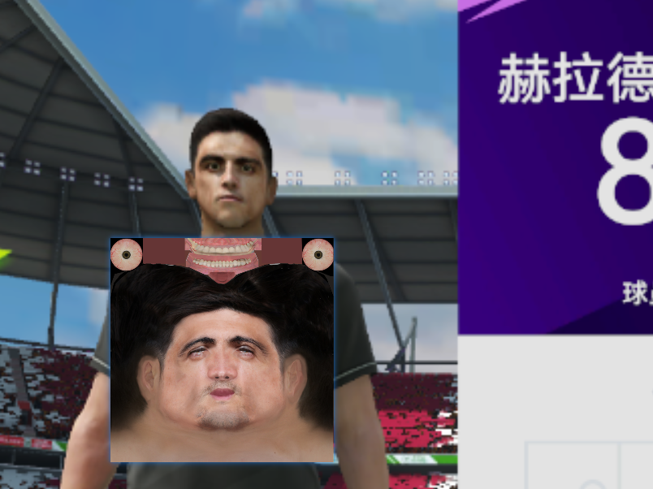

**头像Albedo Map 自动验收工具的大致工作逻辑**：

1.  裁剪人物头像的albedo map中法线变化最剧烈的区域（眼窝下以及鼻子）并查看颜色的一致性；如果有明显与周围不一致的颜色则认定为albedo map引入了不应有的高光 /阴影
    
    1.  （人物面部高光应该制作在粗糙度/光滑度贴图上：Multi贴图的R通道，AO阴影应该在Multi贴图的G通道；示例如下）。
        

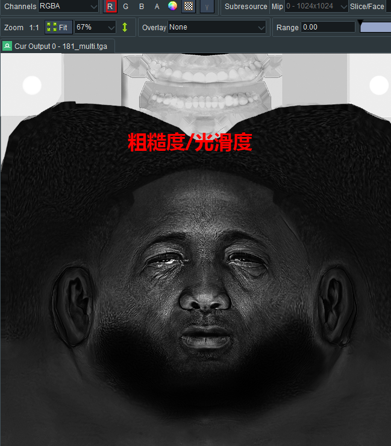

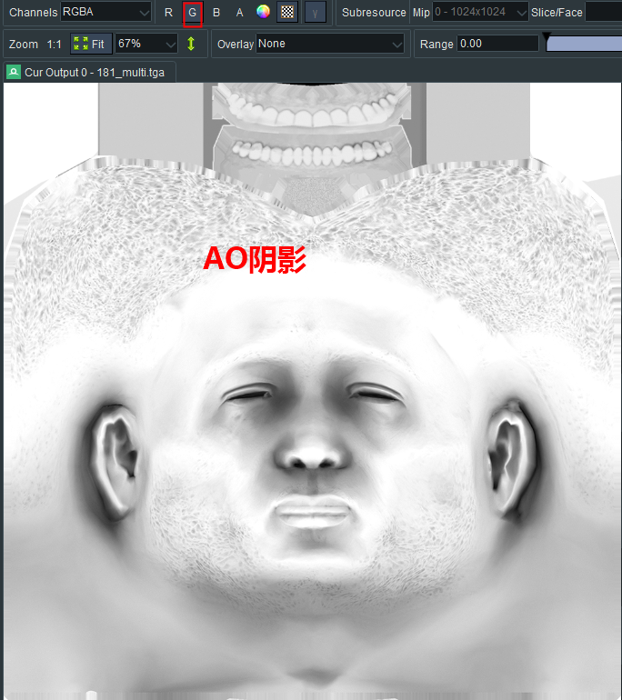

2.  裁剪人物瞳孔附近，判定有无高光（眼睛高光写在了游戏内眼睛着色器上）
    

**验收操作流程：**

1.  双击打开验收器，可能需要几秒钟的加载：
    

 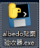

2.  加载完毕后的验收器：
    

 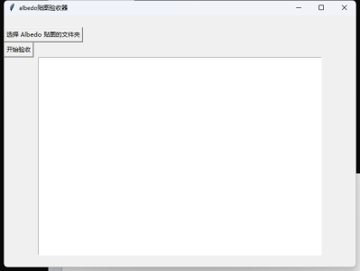

注：不要关闭该窗口：

 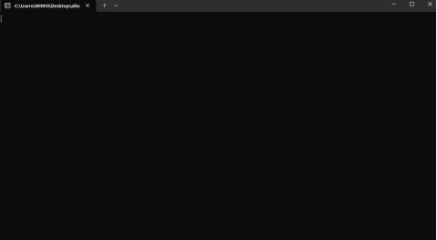

3.  按下图操作：
    

 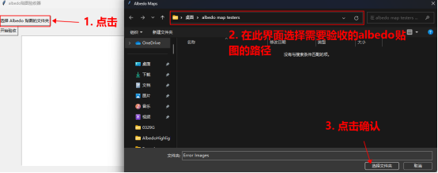

4.  选择完成后确认该路径下保存了此次验收的贴图，并可开始验收
    

 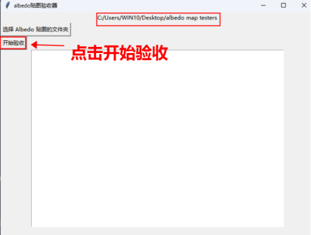

**正常通过**：

看到下图提示则表示该路径下所有albedo贴图都通过验收

 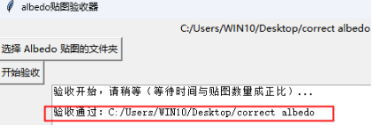

**验收不通过的解释示例**：

当出现验收不通过时，有可能出现以下情况：

1.  眼睛处有高光
    
2.  面部有明显不正确的高光
    
3.  以上两种情况都有
    

**眼睛高光错误以及正确范例**

（标记图会在验收文件夹内新建的Error Images文件夹内）

 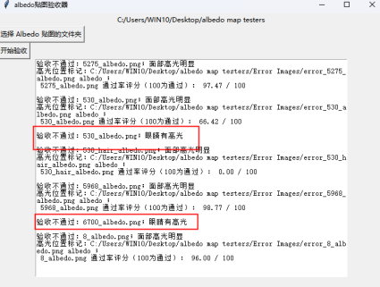

 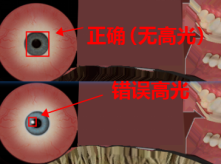

**面部高光评分解释以及正确范例**

评分解释：

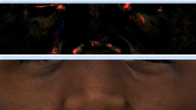

 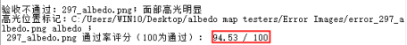

高亮位置标红处高于一个不可接受的阈值时，则会触发验收不通过。**标红像素越高，则评分越低**。具体解释以及验收不通过的可能原因如下：

在游戏中，albedo贴图代表的是与其对应的网格处本身的颜色，该颜色不应收到灯光的影响变亮或产生阴影；而从现实照片映射的albedo贴图会经常带有过亮的高光或者AO阴影。

 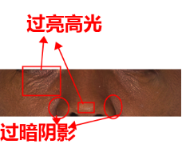

验收器会自动判定贴图中最容易出错的区域（i.e. 鼻子附近）的平均亮度，并以此判断过亮的高光占比；过分高于平均亮度的像素会被标记为红色，稍高于平均亮度的则会保留该像素原本的颜色。（标记图会在验收文件夹内新建的Error Images文件夹内）

 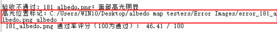

 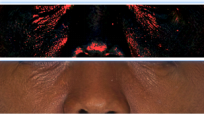

如果错误的阴影过多过深则会拉低平均亮度，导致可以接受的结构高光被标红

（如下图所示）

 

**报错以及解决办法**

如果看到"无效路径"，请检查有没有选择需要验收的文件夹路径

 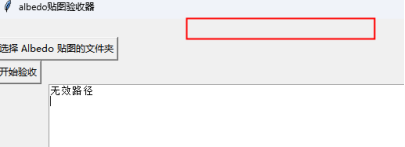

如果该路径下没有albedo贴图并点击开始验收，则会收到以下报错；重新选择带有albedo贴图的文件夹即可

 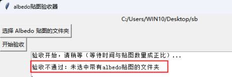