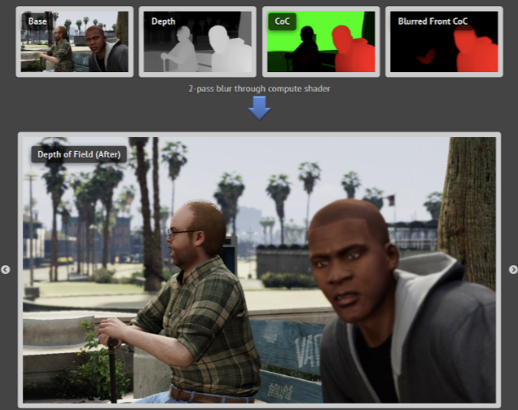

# 基于相机Z轴深度的景深背景模糊RenderFeature

# 介绍

景深（DoF）是摄影和电影制作中的一个关键概念，指的是场景中在可接受的清晰范围内的距离。利用景深效果可以显著增强图像或视频的视觉叙事，通过艺术性地模糊不太相关的背景或前景元素，将观众的注意力引导到特定的主体上。

在此之前的游戏项目工程中，我们利用的是简单的高斯模糊掉整张清晰的画面，再把需要"合焦"的物体抠出来用清晰的图。然而在这个实现方法中会存在一些不真实感: 1. 简单高斯模糊无法产生虚焦光斑（bokeh）2. 无法实现平顺的对焦/追焦效果（因为本质上没有"对焦"这个动作）。

为此，我们需要一个基于游戏内相机Z轴深度的新的景深&背景模糊的效果，从而能够解决上述的不真实感，让画面更接近现实中相机所拍摄的效果。

# 原理简述

### 管线

此feature大致follow了GTA5中镜头景深的管线流程，如下图所示

该管线需要从从相机视角下渲染的Z-depth得到一张COC\[1\] RT, 以此对相机纯光栅化得到的完全清晰的RT以及利用算法得到的模糊贴图做插值，可以得到近似于真实相机的景深效果。（具体原理可以看文末的参考）

\[1\]:circle of confusion; 模拟真实世界中相机底片投影的容许弥散圆范围

### 模糊贴图流程

### 最终效果合成

# 部署

自动对焦：

自动对焦的参数作用参考

该脚本有程序化调整 bokeh radius, focus distance 和 focus range的方法，具体可参考以下路径中存放的API以及脚本本身代码实现（用浏览器打开html文件即可）：Assets/Render\_UMP/RenderBase/Docs/html/class\_depth\_of\_field\_on\_z\_axis\_auto\_focus\_controller.html

# 常见BUG以及解决方法

1.  **如果景深失效则**
    
    1.  **检查除去该景深外其他的render feature中是否被清理了Depth，需要取消勾选其Clear Depth按钮，并重新激活该景深的render feature**
        

2.  **MSAA会disable相机深度图，需要关闭MSAA**
    

后续工作

目前该feature仅在render4D中使用，后续可考虑用

# Demo

### 光斑（bokeh）左图为简单高斯，右边为增加光斑后

### 自动对焦以及动态bokeh调整

真实相机对焦动作对比

# 参考

[GTA V - Graphics Study - Part 3 - Adrian Courrèges (adriancourreges.com)](https://www.adriancourreges.com/blog/2015/11/02/gta-v-graphics-study-part-3/)

[https://catlikecoding.com/unity/tutorials/advanced-rendering/depth-of-field/](https://catlikecoding.com/unity/tutorials/advanced-rendering/depth-of-field/)

[请至钉钉文档查看附件《DoF Academic Overview.pdf》](https://alidocs.dingtalk.com/i/nodes/YMyQA2dXW79rwZoysKkYvQrEJzlwrZgb?doc_type=wiki_doc&iframeQuery=anchorId%3DX02lxcw5nlkhm1dvu1yc0h)